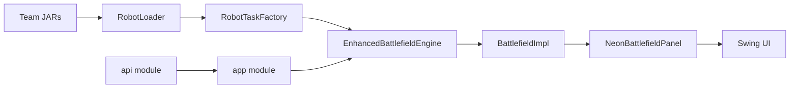

<div align="center">

# Robot Wars Battle Engine

Self-hosted Java battle simulator for programmable robot teams, modular APIs, real-time Swing rendering, team JAR loading, and Docker-based execution.

[](#verification)
[](LICENSE)


</div>

## Overview

Robot Wars Battle Engine is a modular Java application where robot teams are loaded from JAR files and compete on a real-time battlefield. Each team provides a leader and droid behavior through the public API. The application handles spawning, movement, scanning, firing, damage, energy management, kill tracking, and visual feedback through a Swing-based terminal-style interface.

## Screenshots


A recorded demo is also available in [robots/demo-jeu-java.mp4](robots/demo-jeu-java.mp4).

## Architecture



| Path | Responsibility |
| --- | --- |
| `api/` | Public robot, battlefield, view, and factory contracts. |
| `robots/app/` | Runnable Swing application, engine loop, rendering, loaders, and tests. |
| `robots/tasks/` | Built-in robot team implementations and sample strategies. |
| `libs/` | Runtime team JARs loaded by the application. |
| `robots/Dockerfile` | Containerized runtime for environments without local Java setup. |

## Requirements

- Java 17 or newer
- Docker with X11 forwarding for containerized GUI execution

The Gradle wrapper is committed, so no system Gradle installation is required.

## Run Locally

```bash
cd robots
./gradlew :app:run
```

## Run With Docker

```bash
cd robots
./run-docker.sh
```

The Docker runner builds from the repository root so the container can access `api/`, `libs/`, and `robots/`. On Linux, make sure an X11 session is available. On macOS or Windows, run an X server such as XQuartz, VcXsrv, or Xming and adjust `DISPLAY` if needed.

## Build

```bash
cd robots
./gradlew :app:build
```

Build all packaged team JARs:

```bash
cd robots
./gradlew :tasks:buildAllTeams
```

## Gameplay

1. Launch the application.
2. Select at least two available teams.
3. Assign colors and add teams to the battle list.
4. Start the battle.
5. The engine runs until one team remains or the timeout/draw condition is reached.

## Verification

The application was compiled with:

```bash
cd robots
./gradlew :app:compileJava
```

Screenshots were captured from a real Swing launch under Xvfb.

## License

This project is released under the [MIT License](LICENSE).
