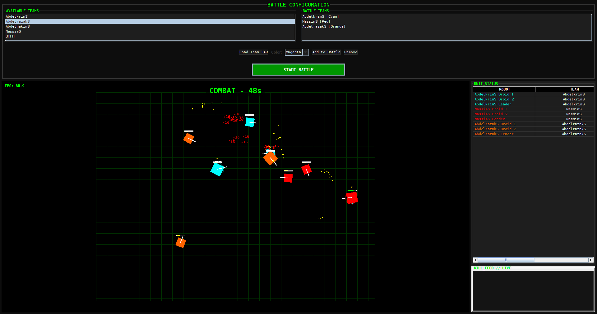
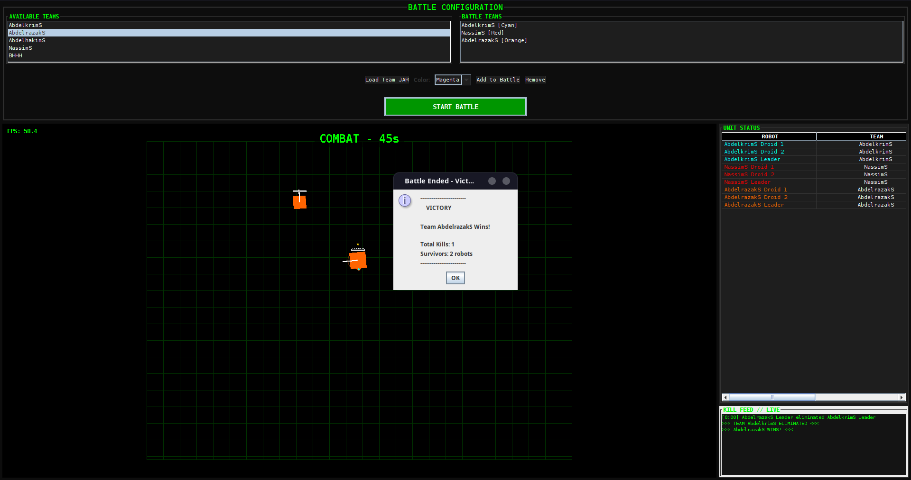
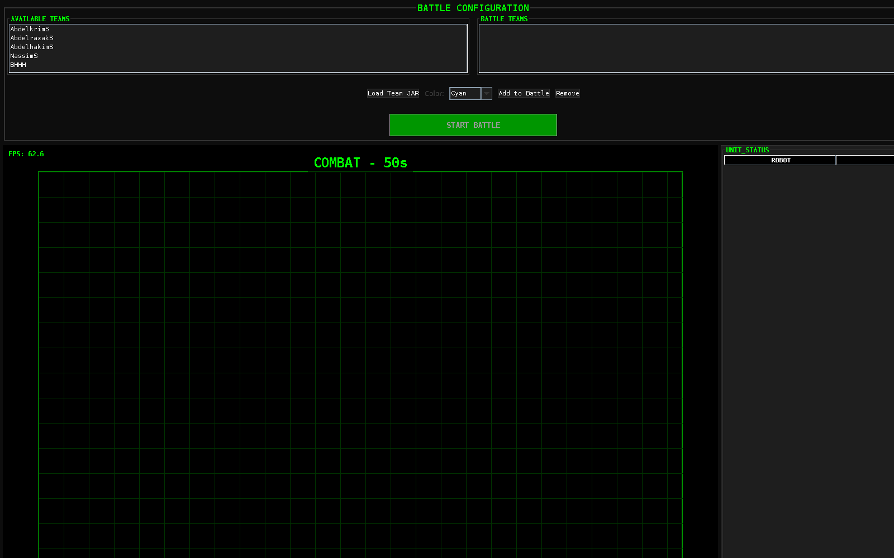
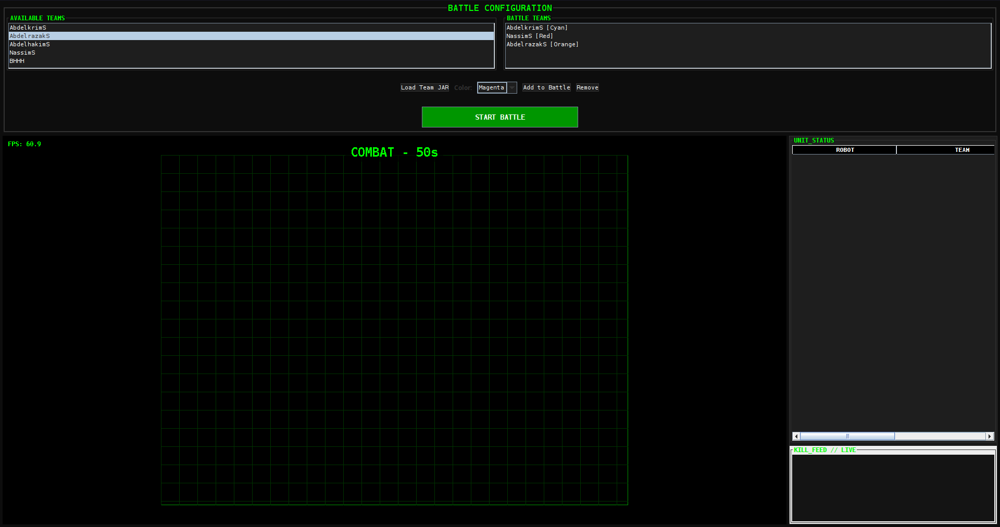
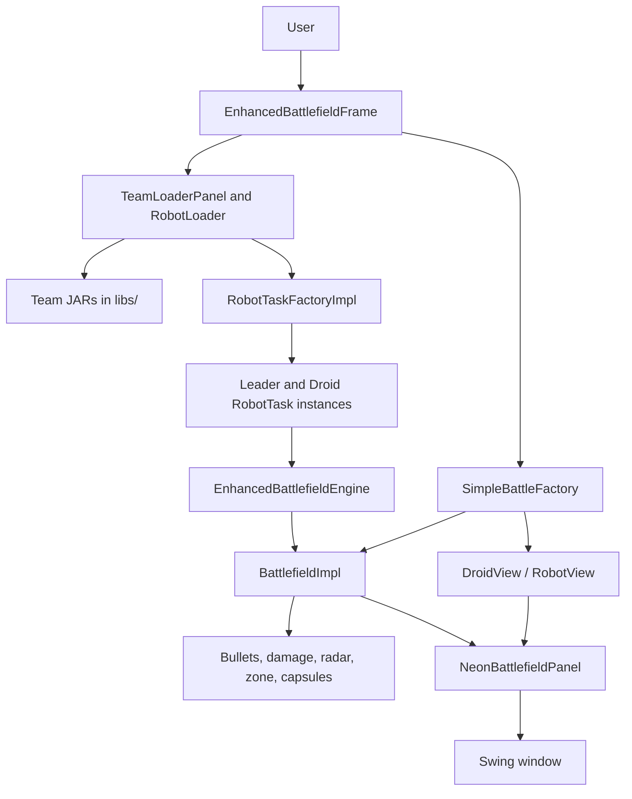

<div align="center">

<h1>Robot Wars Battle Engine</h1>

Programmable Java robot battles with real-time combat, runtime team loading, autonomous droids, leader coordination, and a neon terminal-style Swing interface.

[](LICENSE)


</div>

## Overview

Robot Wars Battle Engine is a Java strategy simulator where multiple autonomous robot teams fight in a real-time arena. Each team is packaged as a JAR, loaded dynamically, assigned a color, and deployed with one team leader plus two combat droids.

The project combines a public robot API, a runnable Swing application, runtime class loading, a battlefield simulation loop, and bundled example teams. It is designed both as a playable robot battle game and as a clean base for experimenting with robot AI strategies.



## Highlights

- Real-time Java battle simulator running at roughly 60 ticks per second.
- Dynamic team loading from external JAR files.
- Public API for droid, robot, team leader, battlefield, factory, and view contracts.
- Multi-team matches with colors, team leaders, droids, radar, guns, bullets, and collision rules.
- Live Swing dashboard with battle configuration, unit status, kill feed, FPS, and match timer.
- Configurable game balance through `game-config.properties`.
- Automated tests for ballistics, physics, energy, radar, collisions, rendering logic, and team loading.
- Docker support for reproducible GUI execution.

## Screenshots

| Live Combat | Victory Dialog |
| --- | --- |
|  |  |

| Startup | Post Battle |
| --- | --- |
|  |  |

## Recommended Quick Start

For local development, run the Swing app directly with the Gradle wrapper:

```bash
cd robots
./gradlew :app:run
```

For validation before pushing changes, run:

```bash
cd robots
./gradlew :app:test :tasks:buildAllTeams
```

For a reproducible GUI environment, use Docker:

```bash
cd robots
./run-docker.sh
```

Recommended workflow:

1. Edit robot strategies in `robots/tasks/`.
2. Rebuild team JARs with `./gradlew :tasks:buildAllTeams`.
3. Launch the app with `./gradlew :app:run`.
4. Select at least two teams from the battle configuration panel.
5. Run the match and observe behavior through the unit status and kill feed.
6. Run `./gradlew :app:test :tasks:buildAllTeams` before committing.

## Gameplay

At startup, the application scans `libs/` for team JAR files and displays them in the **Available Teams** list. The player adds teams to the match, assigns colors, and starts the battle.

Each selected team spawns with:

- 1 `TeamLeader`
- 2 `Robot` droids
- One shared team color
- One leader task
- One task per droid

During the match, robots can:

- Move across the battlefield
- Rotate their body
- Rotate their gun
- Rotate their radar
- Scan for enemy locations
- Fire bullets with configurable power
- Receive and execute team leader commands
- Regenerate energy and recover energy from successful hits

The battle ends when only one robot remains or when the engine reaches its timeout condition.

## Combat And Simulation Rules

The main battle loop is implemented in `EnhancedBattlefieldEngine` and executes repeatedly while a match is active. On every tick, the engine updates the phase manager, applies regeneration, detects collisions, cools guns, updates the shrinking battle zone, applies sudden-death bleed damage, updates energy capsules, removes destroyed robots, processes team messages, and runs active robot tasks.

Core combat systems:

- **Ballistics**: bullets are spawned from the gun barrel and travel across the arena.
- **Damage**: bullet damage is based on fire power.
- **Life steal**: successful hits can restore energy to the shooter.
- **Gun heat**: firing increases heat, and overheated guns cannot fire until cooled.
- **Collision handling**: robot movement and bullet impact rules are enforced by the battlefield.
- **Battle zone**: pressure phases shrink the safe area and later apply bleed damage.
- **Energy capsules**: capsules create tactical recovery points during combat.
- **Wreckage and effects**: destroyed robots, muzzle flashes, hit events, and damage numbers are rendered in the battlefield UI.

Current balance settings are stored in:

[robots/app/src/main/resources/game-config.properties](robots/app/src/main/resources/game-config.properties)

## Match Phases

The phase manager controls battle pacing:

| Phase | Behavior |
| --- | --- |
| `SKIRMISH` | Default combat phase. Robots fight normally. |
| `PRESSURE` | The battle zone starts shrinking. |
| `SUDDEN_DEATH` | The zone shrinks faster and bleed damage is applied. |

The UI displays the current combat label and remaining phase time at the top of the battlefield.

## User Interface

The application uses a compact Swing command center layout:

- **Battle configuration** at the top: available teams, selected battle teams, color selection, JAR loading, and start button.
- **Battlefield** in the center: neon grid, robots, gun headings, radar headings, bullet trails, damage numbers, and combat effects.
- **Unit status** on the right: active robots grouped by team color.
- **Kill feed** on the right: eliminations and winner announcements.
- **HUD** over the arena: FPS, phase label, and match timer.

The UI is intentionally dense and readable so the match can be monitored while several teams fight at once.

## Architecture



### Modules

| Module | Purpose |
| --- | --- |
| `api` | Stable public interfaces used by the app and robot teams. |
| `robots/app` | Runnable game, Swing UI, engine implementation, rendering, loaders, and tests. |
| `robots/tasks` | Bundled team strategies and Gradle tasks that build team JARs. |
| `libs` | Runtime team JARs discovered by the app. |

### Runtime Flow

1. `Launcher` creates `SimpleBattleFactory` and `RobotTaskFactoryImpl`.
2. `EnhancedBattlefieldFrame` builds the Swing UI and battlefield.
3. `TeamLoaderPanel` scans `libs/` and loads team metadata.
4. The user selects teams and starts a match.
5. The app reloads each selected JAR and creates leader/droid tasks.
6. `EnhancedBattlefieldEngine` starts the simulation loop.
7. `BattlefieldImpl` owns robots, bullets, wreckage, energy capsules, damage events, and zone state.
8. `NeonBattlefieldPanel` renders the current state.
9. `ControlsPanel` updates unit status, kill feed, and winner information.

## Repository Layout

```text
.
+-- api/
|   +-- src/main/java/fr/ensibs/robots/
|       +-- logic/       # Droid, Robot, TeamLeader, Battlefield, messages
|       +-- factories/   # BattleFactory and RobotTaskFactory contracts
|       +-- view/        # Swing-facing drawable/view contracts
+-- libs/                # Runtime team JARs
+-- robots/
|   +-- app/             # Main application, engine, UI, tests
|   +-- tasks/           # Bundled team source code
|   +-- Dockerfile
|   +-- docker-compose.yml
|   +-- gradlew
|   +-- run-docker.sh
+-- docs/screenshots/    # README screenshots
+-- README.md
```

## Requirements

- Java 17 or newer
- Linux, macOS, or Windows with a graphical desktop for local Swing execution
- Docker and Docker Compose if using the containerized launch path
- X11 display access when running the GUI from Docker

The Gradle wrapper is included in `robots/`, so installing Gradle separately is not required.

## Build Commands

Run the app:

```bash
cd robots
./gradlew :app:run
```

Run tests:

```bash
cd robots
./gradlew :app:test
```

Build bundled team JARs:

```bash
cd robots
./gradlew :tasks:buildAllTeams
```

Build everything recommended for development:

```bash
cd robots
./gradlew :app:test :tasks:buildAllTeams
```

Build only the application:

```bash
cd robots
./gradlew :app:build
```

## Docker

Use Docker when you want the same runtime environment across machines.

```bash
cd robots
./run-docker.sh
```

Or run Docker Compose manually from the repository root:

```bash
docker compose -f robots/docker-compose.yml build
docker compose -f robots/docker-compose.yml up
```

On Linux, allow local Docker containers to access X11 if your desktop blocks it:

```bash
xhost +local:docker
```

On macOS or Windows, start an X server such as XQuartz, VcXsrv, or Xming and configure `DISPLAY` for your environment.

## Creating A Custom Team

Robot teams are loaded from JAR files. A valid team JAR should contain:

- One leader task implementing `RobotTask<TeamLeader>`
- One or more droid tasks implementing `RobotTask<Robot>`
- Public no-argument constructors for each task class
- Optional `TEAM_NAME` and `TEAM_COLOR` public constants on the leader class

The loader discovers concrete `RobotTask` implementations through reflection. Leader tasks are detected from their generic `TeamLeader` type, and droid tasks are detected from their generic `Robot` type.

Recommended team strategy structure:

- Use the leader to coordinate global decisions.
- Use droids for local movement, scanning, aiming, and firing.
- Avoid firing continuously without considering gun heat.
- Use radar scans to update target positions.
- Keep robots moving to reduce incoming hits.
- Rebuild your JAR after each strategy change.

Bundled examples are available in:

[robots/tasks/src/main/java/fr/ensibs/tasks](robots/tasks/src/main/java/fr/ensibs/tasks)

## Bundled Teams

The repository includes several team JARs in `libs/`, including:

- `AbdelkrimS.jar`
- `AbdelhakimS.jar`
- `AbdelrazakS.jar`
- `NassimS.jar`
- `BHHH.jar`

These are loaded automatically by the application and can be rebuilt from `robots/tasks`.

## Testing

The application test suite covers key behavior:

- Battlefield creation and factory integration
- Bullet physics and ballistics
- Collision detection
- Damage, energy, and life-steal rules
- Gun heat behavior
- Radar and predictive targeting
- Droid and robot API behavior
- HUD and render logic
- Team loading from JARs

Recommended verification before commit:

```bash
cd robots
./gradlew :app:test :tasks:buildAllTeams
```

## Recommended Improvements

High-impact improvements for future work:

- Add a deterministic replay mode with fixed random seeds.
- Add match export with winner, kills, damage dealt, and survival time.
- Add a tournament mode that runs multiple teams across repeated rounds.
- Add configurable team size from the UI.
- Add a headless simulation mode for CI and AI benchmarking.
- Add richer strategy documentation for external team authors.
- Package release artifacts with application binaries and sample team JARs.

## Production Notes

This is a desktop Swing simulator, so production readiness mainly means reliable local launch, reproducible builds, clear team contracts, and stable test coverage. The recommended production-style checks are:

- Keep Java 17 as the baseline unless all users can move together.
- Rebuild all team JARs after changing `robots/tasks`.
- Run `:app:test` before pushing.
- Keep screenshots and demo media in `docs/` with relative README links.
- Keep balance changes in `game-config.properties` rather than hardcoding constants.
- Prefer adding tests when changing combat rules, physics, loading, or UI status behavior.

## License

This project is released under the [MIT License](LICENSE).
