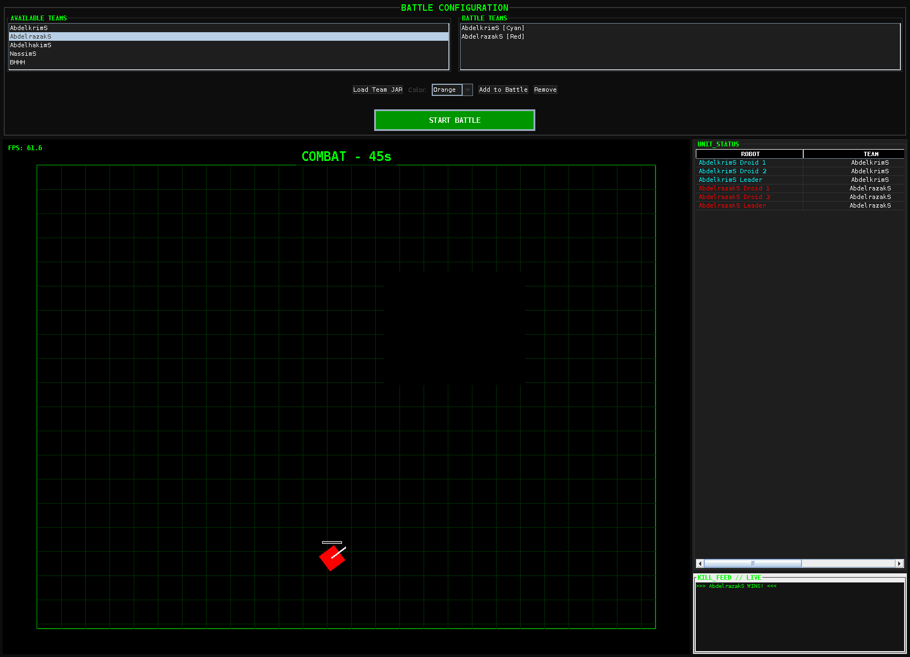
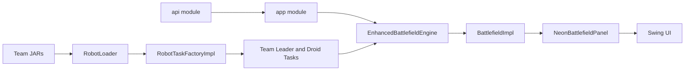

[Image #1]

<div align="center">

# Robot Wars Battle Engine

Programmable Java robot battle simulator with a modular API, Swing rendering, dynamic team JAR loading, and Docker-based execution.

[](LICENSE)


</div>

## Screenshots




A recorded demo is available at [robots/demo-jeu-java.mp4](robots/demo-jeu-java.mp4).

## Overview

Robot Wars Battle Engine lets multiple robot teams compete on a real-time battlefield. Teams are distributed as JAR files, loaded at runtime, and controlled through the public robot API. The engine handles movement, radar scanning, firing, bullet collisions, energy, gun heat, kills, wreckage, HUD overlays, and match lifecycle.

## Architecture



| Path | Responsibility |
| --- | --- |
| `api/` | Public contracts for robots, droids, teams, battlefield logic, factories, and views. |
| `robots/app/` | Runnable Swing application, engine loop, rendering, team loading, match orchestration, and tests. |
| `robots/tasks/` | Source code for bundled robot team strategies and sample tasks. |
| `libs/` | Runtime team JARs loaded automatically by the application. |
| `docs/screenshots/` | README screenshots captured from a real app launch. |
| `robots/Dockerfile` | Container image for running the GUI application with X11 forwarding. |

## Requirements

- Java 17 or newer
- Docker and Docker Compose for containerized execution
- X11 display access when running the GUI from Docker

Gradle is provided through the wrapper; a system Gradle installation is not required.

## Run Locally

```bash
cd robots
./gradlew :app:run
```

## Build And Test

```bash
cd robots
./gradlew :app:test :tasks:buildAllTeams
```

Build only the application distribution:

```bash
cd robots
./gradlew :app:build
```

Build all bundled team JARs into `libs/`:

```bash
cd robots
./gradlew :tasks:buildAllTeams
```

## Docker

The project is Dockerized for environments where Java is not installed locally.

```bash
cd robots
./run-docker.sh
```

Or with Compose:

```bash
docker compose -f robots/docker-compose.yml build
docker compose -f robots/docker-compose.yml up
```

On Linux, allow X11 access before launching the container if your desktop session requires it:

```bash
xhost +local:docker
```

On macOS or Windows, run an X server such as XQuartz, VcXsrv, or Xming and adjust `DISPLAY` as needed.

## Gameplay

1. Launch the application.
2. Select at least two teams from the available team list.
3. Choose team colors and add them to the battle list.
4. Start the battle.
5. Watch the match until one team wins or the battle reaches its draw condition.

## Verification

Current verification:

```bash
cd robots
./gradlew :app:test :tasks:buildAllTeams
cd ..
docker compose -f robots/docker-compose.yml build
```

Screenshots in `docs/screenshots/` were captured from the running Swing application under Xvfb.

## License

This project is released under the [MIT License](LICENSE).
